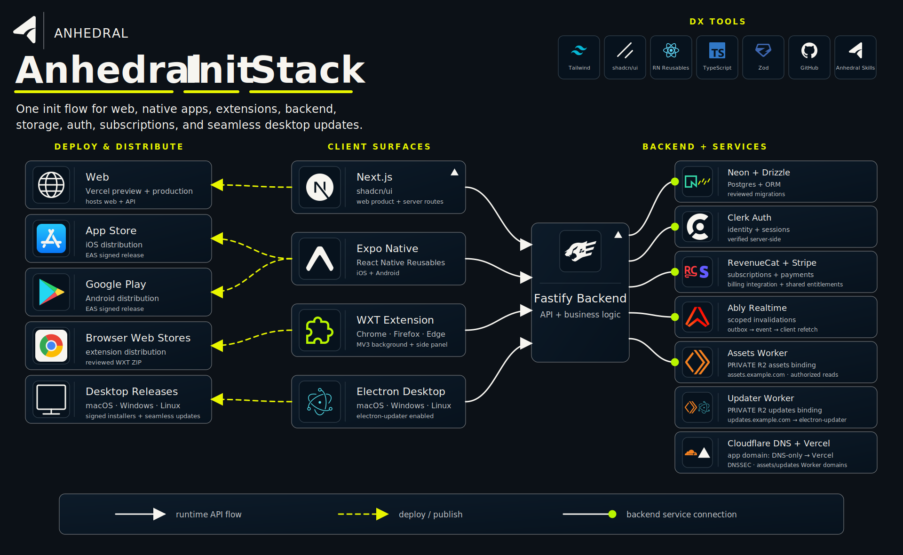

# Anhedral

[](https://www.npmjs.com/package/anhedral)
[](https://www.npmjs.com/package/anhedral)

Anhedral generates a complete, production-oriented TypeScript stack whose source code stays understandable and customizable.

> **Three-second version:** Start with the full TypeScript stack. Keep every escape hatch.



Anhedral is not a new programming language and generated applications do not run inside a proprietary application framework. It assembles well-documented tools, connects their difficult integration boundaries, and leaves developers with ordinary Next.js, Expo Router, Fastify, Drizzle, Electron, and WXT projects.

Anhedral is open source under the [Apache License 2.0](LICENSE). You may use,
modify, and distribute it subject to that license, including its notice and
redistribution requirements. Generated applications remain ordinary project
source that their developers can customize and license for their products.

## Recommended: use the coding-agent skill

Install the Anhedral skill for Codex, Claude Code, or another compatible coding
agent:

```sh
pnpm dlx skills add https://github.com/anhedral/anhedral-init --skill anhedral-init
```

Choose the agent and global or project scope when prompted. Then ask the agent:

```text
Use $anhedral-init to create and provision my application.
```

The skill begins by asking for the project name and whether you already own a
custom domain. It selects the CLI command with you, detects Computer Use and
subagent support, generates the project, and walks through the selected cloud
providers. It pauses for sign-in, MFA, payments, secret generation, and final
release submissions. Paste secrets directly into the instructed uncommitted
`.env` file or protected provider field—never into chat.

## Create an application directly

Create the complete stack:

```sh
pnpm dlx anhedral@latest new my-product
cd my-product
```

The generated `README.md` contains the exact next steps for the selected stack.
For the complete stack, copy the package-local environment examples, configure
the selected managed providers—including a Neon `DATABASE_URL`—and create the
reviewed initial migration before running `pnpm dev`. Anhedral intentionally
does not generate a local Postgres substitute or pretend that production
provider credentials already exist.

With no module flags, `new` includes every supported application surface and backend capability. Generate a focused stack by naming only what the product needs:

```sh
pnpm dlx anhedral@latest new my-product --web --api --db --auth
pnpm dlx anhedral@latest new my-api --api --db
pnpm dlx anhedral@latest new my-clients --web --mobile
```

`init` generates the same workspace in the current empty directory:

```sh
mkdir my-product && cd my-product
pnpm dlx anhedral@latest init --web --api --db --auth
```

Interactive terminals prompt for surfaces and capabilities. CI and coding agents should pass explicit module flags.

## What gets generated

```text
my-product/
├── apps/
│   ├── web/                    # Next.js App Router + source-owned shadcn/ui
│   ├── mobile/                 # Expo Router + React Native Reusables
│   ├── api/                    # Fastify routes, backend modules, auth, providers
│   ├── desktop/                # Electron + React
│   ├── extension/              # WXT browser extension
│   ├── assets-private-proxy/   # Cloudflare Worker for private asset delivery
│   └── desktop-updater-worker/ # private R2 Electron update delivery
├── packages/
│   ├── contracts/              # shared Zod network contracts
│   ├── api-client/             # typed client used by every frontend
│   ├── db/                     # Drizzle schema and reviewed migrations
│   └── realtime/               # Ably client when billing is selected
├── docs/
│   ├── DEVELOPMENT.md          # task-oriented feature recipes
│   └── STACK.md                # tool map and official documentation
├── README.md                   # first run and where-to-write-code map
├── PRODUCTION.md               # selection-specific release runbook
├── SKILL.md                    # repository guidance for coding agents
├── ANHEDRAL.md                 # generator and ownership notes
└── anhedral.json               # modules, versions, provenance, ownership
```

Whole directories are omitted when their module is not selected. Generated documentation is selection-aware.

## Developer experience

Developers use each tool normally:

```tsx
// apps/web/app/projects/page.tsx
import { ProjectList } from '@/components/projects/project-list';

export default function ProjectsPage() {
  return <ProjectList />;
}
```

```ts
// packages/contracts/src/app.ts
import { z } from 'zod';

export const ProjectSchema = z.object({ id: z.string(), name: z.string() });
export const ProjectListSchema = z.array(ProjectSchema);
```

```ts
// packages/db/src/app-schema.ts
import { pgTable, text } from 'drizzle-orm/pg-core';

export const projects = pgTable('projects', {
  id: text('id').primaryKey(),
  name: text('name').notNull(),
});
```

```ts
// apps/api/src/routes/app.ts
import type { FastifyPluginAsync } from 'fastify';
import { db } from '@shared/db';
import { projects } from '@shared/db/schema';

export const appRoutes: FastifyPluginAsync = async (app) => {
  app.get('/projects', async () => db.select().from(projects));
};
```

The convention is a conventional vertical flow, not an Anhedral DSL:

```text
contracts -> database/service -> Fastify route -> typed API client -> frontend
```

- Write web product code under `apps/web` using Next.js conventions.
- Write mobile product code under `apps/mobile` using Expo Router conventions.
- Register product routes in `apps/api/src/routes/app.ts` and add server-only feature modules under `apps/api/src` using Fastify conventions.
- Write product tables in `packages/db/src/app-schema.ts` and queries under `packages/db` using Drizzle conventions.
- Share only network contracts and client-safe packages with frontends.
- Import the underlying framework directly whenever its API is the right tool.

## The stack

| Concern | Default | Why Anhedral includes it |
| --- | --- | --- |
| Web | Next.js + Vercel | App Router, React server rendering, routing, deployment |
| Native | Expo Router | One TypeScript application for iOS and Android |
| API | Fastify | Typed validation, structured logging, plugin boundaries |
| Database | Neon + Drizzle | Managed Postgres with TypeScript schema and SQL-like queries |
| Authentication | Clerk | Connected frontend and backend identity/session flows |
| UI | shadcn/ui + React Native Reusables | Accessible source code the application owns |
| Storage | private Cloudflare R2 | Signed uploads and controlled asset delivery |
| Billing/realtime | RevenueCat + Stripe + Ably | Unified billing entitlements and realtime invalidation |
| Desktop | Electron | Predictable cross-platform TypeScript desktop runtime |
| Desktop updates | electron-updater + private R2 + Worker | Signed automatic updates through a product-owned custom domain |
| Extension | WXT | Browser-extension entrypoints, builds, and packaging |
| Workspace | pnpm + Turborepo | Strict dependencies and dependency-aware tasks |

Anhedral does **not** generate or require local Postgres. Database-enabled projects use a managed Neon connection through `DATABASE_URL`; teams should use isolated Neon branches or projects for development, preview, and production.

## Commands

```text
anhedral new <directory> [modules...]    Generate a new readable workspace
anhedral init [modules...]               Generate in the current empty directory
anhedral add <module...>                 Add connected stack capabilities
anhedral ui add <component...>           Add source-owned UI components
anhedral upgrade                         Transactionally upgrade a supported project
anhedral doctor                          Check ownership and generator drift
```

Useful examples:

```sh
anhedral add storage --dry-run
anhedral add desktop extension
anhedral add electron-updater
anhedral ui add button dialog
anhedral ui add data-table --target web --dry-run
anhedral upgrade --dry-run
anhedral doctor --json
```

`--dry-run` builds the complete plan without changing the project. `--json` emits machine-readable output. `--verbose` streams child-tool diagnostics.

Application lifecycle commands remain visible in the generated root `package.json`:

```sh
pnpm dev
pnpm dev:all
pnpm dev:web
pnpm dev:api
pnpm typecheck
pnpm verify
pnpm build
pnpm db:generate
pnpm db:migrate
```

`pnpm dev` starts the primary product loop: the first selected client plus the
API when present, or the API by itself for backend-only projects. In the full
stack that means web plus API. `pnpm dev:all` appears only when the project has
additional surfaces and intentionally starts all of them. Only commands
relevant to selected modules are generated.

## Extensibility and ownership

Anhedral owns initial assembly and safe structural additions. It does not own product architecture after generation.

- `README.md`, `PRODUCTION.md`, application features, pages, routes, services, and domain code are developer-owned.
- Root workspace configuration is mergeable.
- Integration substrate is recorded in `anhedral.json`; `anhedral add` refuses to overwrite modified managed files.
- UI components are copied into the application so developers can edit them normally.
- Provider integrations use ordinary SDKs and configuration files with no hidden control plane.

Before a structural change:

```sh
anhedral doctor
anhedral add <module> --dry-run
```

When `doctor` reports that a project was generated by a supported older release, run `anhedral upgrade --dry-run`, inspect the plan, and then run `anhedral upgrade`. Version 0.4 supports transactional upgrades from 0.3 projects while preserving user-owned extension seams. If a 0.3 project changed a file that was generator-managed, the upgrade stops instead of overwriting it. Preserve the change in source control, restore that managed file to its recorded 0.3 content, run the upgrade, and then move the product behavior into the new user-owned `app.ts`, `app-schema.ts`, page, component, or `app-window.ts` seam.

## Documentation contract

Every generated project teaches both humans and coding agents how to work in it:

- `README.md` answers how to run the app and where frontend/backend code goes.
- `docs/DEVELOPMENT.md` provides end-to-end feature and common-task recipes.
- `docs/STACK.md` maps generated files to each tool's official documentation.
- `SKILL.md` gives coding agents concise repository-specific workflow and safety rules.
- `PRODUCTION.md` covers only the accounts, environment, infrastructure, DNS, stores, and release steps selected for that project.

The generator's exact output contract is documented in [docs/output-tree-contract.md](docs/output-tree-contract.md). Contributor architecture remains available in the [source repository](https://github.com/anhedral/anhedral-init/tree/main/docs/architecture).

The complete lifecycle, runtime, cloud, command, and coding-agent topology is in
the [Anhedral master stack map](docs/master-stack-map.md).

## Module dependency rules

Anhedral resolves integrations as a deterministic graph:

```text
auth                 -> api + db
billing              -> auth
storage              -> auth
native-subscriptions -> mobile + billing
electron-updater     -> desktop
```

Adding a capability brings the infrastructure it actually requires. Unselected providers do not leave dead source files or environment placeholders behind.

## Verification

The generator and representative public stacks are checked with:

```sh
pnpm typecheck
pnpm test:all
```

Generated workspaces include their own package-level tests, full-stack `verify` command, CI workflow, production environment validation, migration drift gate, and deployment configuration.
