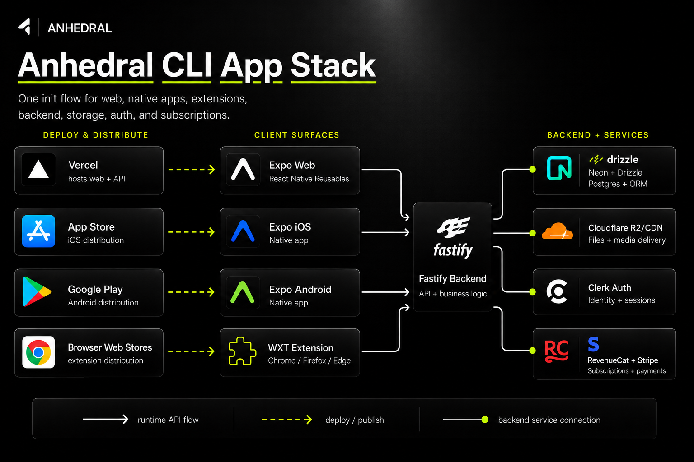

# Anhedral

[](https://www.npmjs.com/package/anhedral)
[](./LICENSE)
[](https://www.npmjs.com/package/anhedral)

One command to start a production-shaped Expo, Fastify, and Chrome extension application.

Anhedral is an opinionated init CLI for teams that want one stable full-stack architecture instead of a menu of half-finished choices. It generates a single pnpm monorepo with an Expo app for web/iOS/Android, a Fastify API, a WXT Chrome extension, shared packages, and deployment-ready structure for Vercel, EAS, and the Chrome Web Store.



## Quick Start

```sh
pnpm dlx anhedral@latest init
```

Or with npm:

```sh
npx anhedral@latest init
```

Use `--skip-install` when you want deterministic file generation before installing dependencies:

```sh
pnpm dlx anhedral@latest init --skip-install
pnpm install
```

## What It Generates

```txt
.
├─ Frontend/        Expo + React Native Reusables app
├─ Backend/         Fastify API
├─ Extension/       WXT Chrome extension
├─ packages/
│  ├─ api-client/   shared typed API client
│  ├─ config/       shared config helpers
│  ├─ db/           Drizzle schema, Neon client, migrations
│  └─ types/        shared TypeScript types
├─ PRODUCTION.md    deployment checklist
├─ turbo.json       workspace task graph
└─ package.json     root scripts
```

The generated app is intentionally one repository. Deploy the same Git repo as two Vercel projects:

- `Frontend`: Expo web export, built with `pnpm build:web`, output to `dist`
- `Backend`: Fastify API, built with `pnpm build`, entrypoint at `src/index.ts`

The same `Frontend` source is used for native iOS and Android builds through EAS. The `Extension` source builds a WXT Chrome extension ZIP for the Chrome Web Store.

## Stack

Anhedral supports one carefully maintained stack:

- Expo + React Native Reusables frontend
- Fastify backend
- WXT Chrome extension
- Neon + Drizzle
- Cloudflare R2/CDN
- Clerk auth
- RevenueCat + Stripe
- Vercel deployment
- pnpm workspaces + Turborepo

The goal is stability. The generated project avoids framework sprawl, duplicate schemas, and separate frontend/backend/extension repositories.

## Local Development

From the generated project root:

```sh
pnpm install
pnpm dev
```

Run one surface at a time:

```sh
pnpm dev:frontend
pnpm dev:backend
pnpm dev:extension
```

Verify before deployment:

```sh
pnpm verify
pnpm verify:frontend
pnpm verify:backend
pnpm verify:extension
```

Database workflow:

```sh
pnpm db:generate
pnpm db:migrate
```

## Provider Setup

Generated projects include placeholder env values so the repository can be inspected before accounts are provisioned. Real auth, billing, uploads, native builds, and extension sign-in require provider keys.

The generated `README.md` and `PRODUCTION.md` explain where every key belongs:

- Neon: `DATABASE_URL`
- Clerk: `EXPO_PUBLIC_CLERK_PUBLISHABLE_KEY`, `CLERK_PUBLISHABLE_KEY`, `CLERK_SECRET_KEY`, `VITE_CLERK_PUBLISHABLE_KEY`
- RevenueCat + Stripe: `EXPO_PUBLIC_RC_*`, `RC_SECRET_API_KEY`, `RC_WEBHOOK_SECRET`
- Cloudflare R2/CDN: `R2_ACCOUNT_ID`, `R2_ACCESS_KEY_ID`, `R2_SECRET_ACCESS_KEY`, `R2_BUCKET`
- Vercel: two projects from the same Git repository, rooted at `Frontend` and `Backend`
- EAS: native iOS and Android builds from `Frontend`
- Chrome Web Store: WXT ZIP upload from `Extension/.output`

## Deployment

### Vercel

Import the same GitHub repository twice:

| Project | Root Directory | Build Command | Output |
| --- | --- | --- | --- |
| Frontend | `Frontend` | `pnpm build:web` | `dist` |
| Backend | `Backend` | `pnpm build` | Fastify entrypoint |

Enable Vercel access to source files outside each project root so workspace packages under `packages/*` resolve during builds.

### EAS

Use `Frontend` as the Expo project root:

```sh
cd Frontend
pnpm dlx eas-cli@latest login
pnpm dlx eas-cli@latest init
pnpm dlx eas-cli@latest build --platform all --profile production
pnpm dlx eas-cli@latest submit --platform all --latest --profile production
```

### Chrome Extension

```sh
pnpm extension:zip
```

Upload `Extension/.output/*-chrome.zip` to the Chrome Web Store Developer Dashboard.

## Dependency Policy

`pnpm dlx anhedral@latest init` gives users the latest published Anhedral CLI, but generated projects use the dependency manifest verified for that release.

Runtime dependency versions live in `src/dependencies.ts`. Generated projects also receive a `stack.json` file recording the exact stack and dependency manifest used for that init run.

This keeps generated apps reproducible while still allowing Anhedral itself to move forward quickly through verified releases.

## Development

Work on the CLI locally:

```sh
pnpm install
pnpm build
pnpm test:all
```

Refresh the checked-in demo output:

```sh
pnpm demo:refresh
```

Validate upstream scaffold drift:

```sh
pnpm test:e2e:latest
```

## Release

Official releases are automatic on merges to `main`. The release workflow bumps the patch version, runs the release checks, creates a release commit and tag, and publishes to npm.

Manual fallback:

```sh
pnpm release:check
npm publish --provenance=false --ignore-scripts
```

## License

MIT
