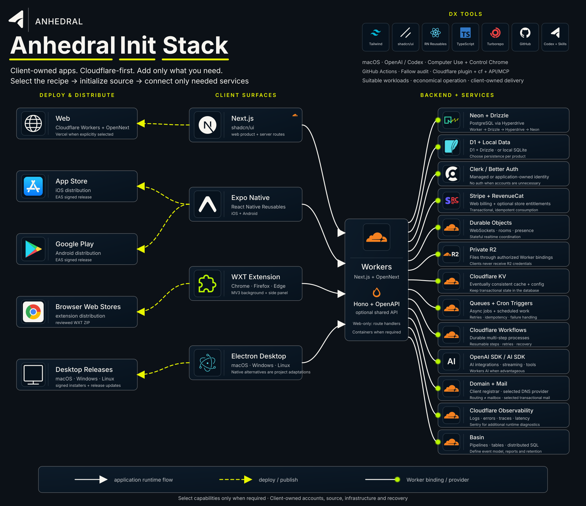

# Anhedral

[](https://www.npmjs.com/package/anhedral)
[](https://nodejs.org/)

Anhedral generates a complete, production-oriented TypeScript stack whose source code stays understandable and customizable.

> **Build once. Ship everywhere. Scale is built in.** Pick the platforms,
> frameworks, and features your product needs; Anhedral assembles them into a
> production-ready TypeScript workspace for web, iOS, Android, desktop, APIs,
> and browser extensions. Start free, skip months of repetitive setup and
> integration work, and focus on what makes your app unique.



For protocol-level routes, trust boundaries, provider bindings, durable state,
release ordering, and the opt-in self-hosted path, open the
[expanded technical communication map](assets/anhedral-cli-init-technical.svg).

Anhedral is not a new programming language and generated applications do not run inside a proprietary application framework. It assembles well-documented tools, connects their difficult integration boundaries, and leaves developers with ordinary Next.js, Expo Router, Fastify, Drizzle, Electron, and WXT projects.

The measurable product and developer-experience contract is documented in the
[Anhedral DX north star](docs/NORTHSTAR.md).

Anhedral is open source under the [Apache License 2.0](LICENSE). You may use,
modify, and distribute it subject to that license, including its notice and
redistribution requirements. Generated applications remain ordinary project
source that their developers can customize and license for their products.

## Recommended: use the coding-agent skill

Install the Anhedral skill for Codex, Claude Code, or another compatible coding
agent:

```sh
pnpm dlx skills add https://github.com/anhedral/anhedral-init --skill anhedral-init
```

Choose the agent and global or project scope when prompted. Then ask the agent:

```text
Use $anhedral-init to create and provision my application.
```

The skill begins by asking for the project name and whether you already own a
custom domain. It selects the CLI command with you, detects Computer Use and
subagent support, generates the project, and walks through the selected cloud
providers. It pauses for sign-in, MFA, payments, secret generation, and final
release submissions. Paste secrets directly into the instructed uncommitted
`.env` file or protected provider field—never into chat.

## Create an application directly

In an interactive terminal, start Anhedral and choose the surfaces and
capabilities you need:

```sh
pnpm dlx anhedral@latest new my-product
cd my-product
```

The suggested selection is a focused web app, and Anhedral shows the complete
resolved stack before it writes anything. To explicitly create every supported
application surface and service capability, use:

```sh
pnpm dlx anhedral@latest new my-product --all
```

The generated `README.md` contains the exact next steps for the selected stack.
Run `pnpm first-run` to create missing local environment files without
overwriting anything, then use `pnpm ready` for a secret-safe readiness check.
For the default stack, configure the selected managed providers—including a
Neon `DATABASE_URL`—and create the reviewed initial migration before running
`pnpm dev`. Self-hosted infrastructure is opt-in and Anhedral never pretends
that production provider credentials or a provisioned server already exist.

In noninteractive environments, no product flags retain the complete-stack
default for compatibility. Prefer `--all` when that is your intent, or name
only what the product needs:

```sh
pnpm dlx anhedral@latest new my-product --next --fastify --neon --clerk
pnpm dlx anhedral@latest new my-api --fastify --neon
pnpm dlx anhedral@latest new my-clients --next --expo
pnpm dlx anhedral@latest new my-vps-app --next --fastify --postgres --ubuntu --docker --nginx --certbot
pnpm dlx anhedral@latest new my-worker --cloudflare-workflows
```

Auth.js is the supported alternative to Clerk for the Next.js stack. It
generates an `app/(auth)` route group, database-backed credentials, secure JWT
sessions, and a server-side bridge to Fastify:

```sh
pnpm dlx anhedral@latest new my-product --next --fastify --neon --authjs
pnpm dlx anhedral@latest new my-product --next --fastify --neon --authjs --admin-page
pnpm dlx anhedral@latest new my-product --next --fastify --neon --authjs --admin-app
```

`--admin-page` creates `apps/web/app/(admin)/admin`. `--admin-app` creates
`apps/admin/app/(auth)` and `apps/admin/app/(admin)` with an independent admin
session boundary, cookie name, and `ADMIN_AUTH_SECRET`. Both modes re-check active platform-admin status in the
database before privileged server operations. After applying the generated
migration, create identities with
`pnpm auth:create-user -- <email> <password> [name] [--admin]`.

`init` generates the same workspace in the current empty directory:

```sh
mkdir my-product && cd my-product
pnpm dlx anhedral@latest init --next --fastify --neon --clerk
```

Interactive terminals prompt for products by stack category. CI and coding agents should pass explicit product flags.

Infrastructure products are independent selectors: `--postgres`, `--ubuntu`,
`--docker`, `--nginx`, and `--certbot`. They are not bundled behind a
deployment-profile flag. Dependency resolution adds only the substrate required
by the selection: Docker adds Ubuntu, PostgreSQL adds Drizzle and Docker, Nginx
adds Docker, and Certbot adds Nginx. The infrastructure artifact includes a
non-mutating review plan plus an explicit Ubuntu-host bootstrap. Inspect with
`pnpm provision:plan` and `pnpm dlx anhedral@latest setup-vps --check`; on the
intended fresh VPS, `pnpm dlx anhedral@latest setup-vps` applies the idempotent
security and hosting baseline.

## What gets generated

```text
my-product/
├── apps/
│   ├── web/                    # Next.js App Router + source-owned shadcn/ui
│   ├── mobile/                 # Expo Router + React Native Reusables
│   ├── api/                    # Fastify routes, backend modules, auth, providers
│   ├── desktop/                # Electron + React
│   ├── extension/              # WXT browser extension
│   ├── assets-private-proxy/   # Cloudflare Worker for private asset delivery
│   ├── workflows/              # Cloudflare durable workflows + authenticated control API
│   └── desktop-updater-worker/ # private R2 Electron update delivery
├── packages/
│   ├── contracts/              # shared Zod network contracts
│   ├── api-client/             # typed client used by every frontend
│   ├── db/                     # Drizzle schema and reviewed migrations
│   └── realtime/               # authenticated Ably client when realtime is selected
├── docs/
│   ├── DEVELOPMENT.md          # task-oriented feature recipes
│   └── STACK.md                # tool map and official documentation
├── deploy/                     # opt-in VPS plan, bootstrap, and hosting substrate
├── README.md                   # first run and where-to-write-code map
├── PRODUCTION.md               # selection-specific release runbook
├── SKILL.md                    # repository guidance for coding agents
├── ANHEDRAL.md                 # generator and ownership notes
└── anhedral.json               # modules, versions, provenance, ownership
```

Whole directories are omitted when their module is not selected. Generated documentation is selection-aware.

## Developer experience

Database-backed client stacks include a working `items` feature on day one. It
connects the Drizzle table, Zod request/response contracts, Fastify list/create
routes, typed client calls, and an idiomatic UI for every selected surface. Use
it to verify the stack, then rename or replace these ordinary user-owned files
with the product idea:

```text
packages/db/src/app-schema.ts
packages/contracts/src/app.ts
apps/api/src/routes/app.ts
packages/api-client/src/app.ts
apps/web/components/item-list.tsx
apps/mobile/components/item-list.tsx
apps/desktop/src/renderer/components/item-list.tsx
apps/extension/src/components/item-list.tsx
```

Only paths for selected clients are generated. Shared contracts and API calls
stay consistent while presentation follows Next.js, React Native, Electron, or
browser-extension conventions.

```ts
// packages/contracts/src/app.ts
import { z } from 'zod';

export const ItemSchema = z.object({
  id: z.string().uuid(),
  name: z.string(),
  createdAt: z.string().datetime(),
});
export const ItemListSchema = z.array(ItemSchema);
```

The flow is a normal TypeScript architecture, not an Anhedral DSL:

```text
contracts -> database/service -> Fastify route -> typed API client -> frontend
```

- Write web product code under `apps/web` using Next.js conventions.
- Write mobile product code under `apps/mobile` using Expo Router conventions.
- Register product routes in `apps/api/src/routes/app.ts` and add server-only feature modules under `apps/api/src` using Fastify conventions.
- Write product tables in `packages/db/src/app-schema.ts` and queries under `packages/db` using Drizzle conventions.
- Share only network contracts and client-safe packages with frontends.
- Import the underlying framework directly whenever its API is the right tool.

## The stack

| Concern | Default | Why Anhedral includes it |
| --- | --- | --- |
| Web | Next.js + Vercel | App Router, React server rendering, routing, deployment |
| Native | Expo Router | One TypeScript application for iOS and Android |
| API | Fastify | Typed validation, structured logging, plugin boundaries |
| Database | Neon + Drizzle | Managed Postgres with TypeScript schema and SQL-like queries |
| Self-hosted database | PostgreSQL | Private runtime, credentials outside Git, off-host backup and restore gates |
| VPS host | Ubuntu + Docker | Recoverable host baseline and container-aware firewall planning |
| Edge and TLS | Nginx + Certbot | Reverse-proxy and observable Let’s Encrypt lifecycle planning |
| Authentication | Clerk | Connected frontend and backend identity/session flows |
| UI | shadcn/ui + React Native Reusables | Accessible source code the application owns |
| Storage | private Cloudflare R2 | Signed uploads and controlled asset delivery |
| Realtime | Ably | Authenticated, user-scoped events across every selected client |
| Durable workflows | Cloudflare Workflows | Retryable multi-step jobs with persisted progress, sleeps, and external events |
| Billing | RevenueCat + Stripe | Unified billing entitlements with realtime invalidation |
| Desktop | Electron | Predictable cross-platform TypeScript desktop runtime |
| Desktop updates | electron-updater + private R2 + Worker | Signed automatic updates through a product-owned custom domain |
| Extension | WXT | Browser-extension entrypoints, builds, and packaging |
| Workspace | pnpm + Turborepo | Strict dependencies and dependency-aware tasks |

Managed database selections use Neon through `DATABASE_URL`; teams should use
isolated branches or projects for development, preview, and production.
`--postgres` instead selects the self-hosted PostgreSQL runtime and generates a
non-mutating plan plus a host-local Ubuntu bootstrap. It never replays remote
commands; the operator explicitly runs
`pnpm dlx anhedral@latest setup-vps` on the intended VPS.

## Commands

```text
anhedral new <directory> [products...|--all] [--ui <components>] [--native-styling <nativewind|uniwind>] [--toolchain <latest|stable>] [--skip-install] [--no-git] [--dry-run] [--json] [--verbose]
  Create a new Anhedral workspace in a new directory; Git is initialized when available unless --no-git is passed.

anhedral init [products...|--all] [--ui <components>] [--native-styling <nativewind|uniwind>] [--toolchain <latest|stable>] [--skip-install] [--git] [--dry-run] [--json] [--verbose]
  Create the same workspace in the current empty directory while preserving its repository state unless --git is passed.

anhedral add <product...|--all> [--toolchain <latest|stable>] [--skip-install] [--dry-run] [--json] [--verbose]
  Resolve and transactionally add connected products to an existing Anhedral workspace without overwriting product-owned code.

anhedral ui add <component...> [--target <client>] [--skip-install] [--dry-run] [--json] [--verbose]
  Add source-owned shadcn/ui or React Native Reusables components to selected generated clients.

anhedral upgrade [--skip-install] [--dry-run] [--json] [--verbose]
  Transactionally upgrade a supported older Anhedral workspace while preserving user-owned extension seams.

anhedral doctor [--json] [--verbose]
  Inspect the manifest, ownership records, managed-file drift, and interrupted transaction state without modifying the workspace.

anhedral setup-vps [--check] [--verbose]
  Validate and apply the generated idempotent Ubuntu VPS security and hosting bootstrap; --check performs validation only.

anhedral --version
  Print the installed Anhedral CLI version.

anhedral --help
  Print current command syntax, products, dependency behavior, and runtime requirements.
```

Run these commands directly when Anhedral is installed, or prefix them with
`pnpm dlx anhedral@latest`, for example
`pnpm dlx anhedral@latest new my-product --next --fastify --neon --clerk`.
The [complete CLI reference](docs/cli-reference.md) documents every product
selector, option, default, compatibility rule, environment variable, and
machine-readable behavior.
Generated workspaces expose `add`, `ui add`, `upgrade`, and `doctor` through the
equivalent `pnpm anhedral:add`, `pnpm anhedral:ui`,
`pnpm anhedral:upgrade`, and `pnpm anhedral:doctor` scripts.

Useful examples:

```sh
pnpm anhedral:add r2 --dry-run
pnpm anhedral:add electron wxt
pnpm anhedral:add electron-updater
pnpm anhedral:add postgres ubuntu docker nginx certbot --dry-run
pnpm anhedral:ui button dialog
pnpm anhedral:ui data-table --target web --dry-run
pnpm anhedral:upgrade --dry-run
pnpm anhedral:doctor --json
```

`--dry-run` builds the structural plan without changing the project. For `ui add`, it also shows the exact provider command; registry-generated file paths are resolved only when the plan is applied. `--json` emits machine-readable output. `--verbose` streams child-tool diagnostics.

Application lifecycle commands remain visible in the generated root `package.json`:

```sh
pnpm first-run
pnpm ready
pnpm dev
pnpm dev:all
pnpm dev:web
pnpm dev:api
pnpm typecheck
pnpm verify
pnpm build
pnpm db:generate
pnpm db:migrate
```

`pnpm dev` starts the primary product loop: the first selected client plus the
API when present, or the API by itself for backend-only projects. In the full
stack that means web plus API. `pnpm dev:all` appears only when the project has
additional surfaces and intentionally starts all of them. Only commands
relevant to selected modules are generated.

## Extensibility and ownership

Anhedral owns initial assembly and safe structural additions. It does not own product architecture after generation.

- `README.md`, `PRODUCTION.md`, application features, pages, routes, services, and domain code are developer-owned.
- Root workspace configuration is mergeable.
- Integration substrate is recorded in `anhedral.json`; `pnpm anhedral:add` refuses to overwrite modified managed files.
- UI components are copied into the application so developers can edit them normally.
- Provider integrations use ordinary SDKs and configuration files with no hidden control plane.

Before a structural change:

```sh
pnpm anhedral:doctor
pnpm anhedral:add <product> --dry-run
```

When `doctor` reports that a project was generated by a supported older release, run `pnpm anhedral:upgrade --dry-run`, inspect the plan, and then run `pnpm anhedral:upgrade`. Version 0.4 supports transactional upgrades from 0.3 projects while preserving user-owned extension seams. If a 0.3 project changed a file that was generator-managed, the upgrade stops instead of overwriting it. Preserve the change in source control, restore that managed file to its recorded 0.3 content, run the upgrade, and then move the product behavior into the new user-owned `app.ts`, `app-schema.ts`, page, component, or `app-window.ts` seam.

## Documentation contract

Every generated project teaches both humans and coding agents how to work in it:

- `README.md` answers how to run the app and where frontend/backend code goes.
- `docs/DEVELOPMENT.md` provides end-to-end feature and common-task recipes.
- `docs/STACK.md` maps generated files to each tool's official documentation.
- `SKILL.md` gives coding agents concise repository-specific workflow and safety rules.
- `PRODUCTION.md` covers only the accounts, environment, infrastructure, DNS, stores, and release steps selected for that project.

The generator's command surface is documented in the
[complete CLI reference](docs/cli-reference.md), and its exact output contract
is documented in [docs/output-tree-contract.md](docs/output-tree-contract.md).
Contributor architecture remains available in the
[source repository](https://github.com/anhedral/anhedral-init/tree/main/docs/architecture).

The complete lifecycle, runtime, cloud, command, and coding-agent topology is in
the [Anhedral master stack map](docs/master-stack-map.md).
Read [Build for What Comes Next](docs/build-for-what-comes-next.md), a short poem
about the problem Anhedral is built to solve.

## Module dependency rules

Anhedral resolves integrations as a deterministic graph:

```text
auth                 -> api + db
realtime             -> auth
billing              -> realtime
storage              -> auth
native-subscriptions -> mobile + billing
electron-updater     -> desktop
```

Adding a capability brings the infrastructure it actually requires. Unselected providers do not leave dead source files or environment placeholders behind.

## Verification

The generator and representative public stacks are checked with:

```sh
pnpm typecheck
pnpm test:all
```

Generated workspaces include their own package-level tests, full-stack `verify` command, CI workflow, production environment validation, migration drift gate, and deployment configuration.
